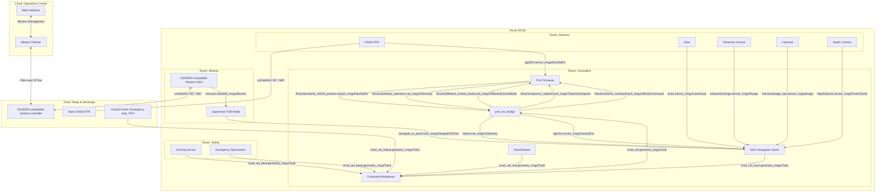

# dionybot

```mermaid
graph TD
    %% ===========================
    %% ROVER SERVICES
    %% ===========================
    subgraph Rover [Rover ROS2]
        %% Sensors
        subgraph Rover_Sensors [Rover: Sensors]
            GNSS[GNSS RTK]
            Lidar[Lidar]
            USS[Ultrasonic Sensor]
            Cameras[Cameras]
            DepthCamera[Depth Camera]
        end

        %% Controllers
        subgraph Rover_Controllers [Rover: Controllers]
            Nav2[Nav2 Navigation Stack]
            RowFollower[RowFollower]
            Mux[Command Multiplexer]
            PX4[PX4 Firmware]
            Bridge[px4_ros_bridge]
        end

        %% Mission
        subgraph Rover_Mission [Rover: Mission]
            MissionClient[VDA5050-compatible mission client]
            Supervisor[Supervisor FSM Node]
        end

        %% Safety
        subgraph Rover_Safety [Rover: Safety]
            DockingServer[Docking Server]
            EStop[Emergency Stop Button]
        end
    end

    %% ===========================
    %% DOCK SERVICES
    %% ===========================
    subgraph Dock [Dock: Relay & Recharge]
        Mission[VDA5050-compatible mission controller]
        BaseRTK[Base GNSS-RTK]
        Panel[Control Panel: Emergency stop, RTH]
    end

    %% ===========================
    %% CLOUD SERVICES
    %% ===========================
    subgraph Cloud [Cloud: Operations Center]
        WebUI[Web Interface]
        Planner[Mission Planner]
    end

    %% ===========================
    %% MISSION & SUPERVISION
    %% ===========================
    WebUI <-->|Mission Management| Planner
    Planner <--->|Fibre avec IP fixe| Mission
    MissionClient <-->|LoRaWAN / RF / WiFi| Mission
    MissionClient -->|/mission:vda5050_msgs/Mission| Supervisor
    Supervisor -->|/navigate_to_pose:nav2_msgs/NavigateToPose| Nav2

    %% ===========================
    %% SENSOR DATA
    %% ===========================
    GNSS <---|LoRaWAN / RF / WiFi| BaseRTK   
    GNSS -->|/gps/fix:sensor_msgs/NavSatFix| PX4
    PX4 -->|/fmu/out/vehicle_GNSS_position:sensor_msgs/NavSatFix| Bridge
    PX4 -->|/fmu/out/vehicle_odometry:nav_msgs/Odometry| Bridge
    Cameras -->|/camera/image_raw:sensor_msgs/Image| Nav2
    DepthCamera -->|/depth/points:sensor_msgs/PointCloud2| Nav2
    USS -->|/ultrasonic/range:sensor_msgs/Range| Nav2
    Lidar -->|/scan:sensor_msgs/LaserScan| Nav2

    %% ===========================
    %% CONTROL / CMD_VEL
    %% ===========================
    Nav2 -->|/cmd_vel_nav2:geometry_msgs/Twist| Mux
    RowFollower -->|/cmd_vel_row:geometry_msgs/Twist| Mux
    DockingServer -->|/cmd_vel_dock:geometry_msgs/Twist| Mux
    Panel -->|/cmd_vel_teleop:geometry_msgs/Twist| Mux
    EStop -->|/cmd_vel_estop:geometry_msgs/Twist| Mux
    Mux -->|/cmd_vel:geometry_msgs/Twist| Bridge
    Bridge  -->|/fmu/in/offboard_control_mode:px4_msgs/OffboardControlMode| PX4
    Bridge  -->|/fmu/in/trajectory_setpoint:px4_msgs/TrajectorySetpoint| PX4
    Bridge  -->|/fmu/in/vehicle_command:px4_msgs/VehicleCommand| PX4
    Bridge -->|/odom:nav_msgs/Odometry| Nav2
    Bridge -->|/gps/fix:sensor_msgs/NavSatFix| Nav2
```