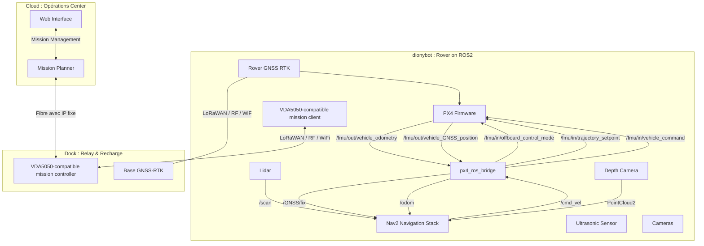

# dionybot

```mermaid
graph TD
    %% Services sur chaque noeud
    subgraph RoverServices [dionybot : Rover on ROS2]
        PX4[PX4 Firmware]
        Nav2[Nav2 Navigation Stack]
        GNSS[Rover GNSS RTK]
        Lidar[Lidar]
        USS[Ultrasonic Sensor]
        Bridge[px4_ros_bridge]
        MissionClient[VDA5050-compatible mission client]
        Cameras[Cameras]
        DepthCamera[Depth Camera]
    end

    subgraph DockServices [Dock : Relay & Recharge]
        Mission[VDA5050-compatible mission controller]
        BaseRTK[Base GNSS-RTK]
    end

    subgraph CloudServices [Cloud : Opérations Center]
        WebUI[Web Interface]
        Planner[Mission Planner]
    end

    %% Flèches de communication

    WebUI <-->|Mission Management| Planner
    Planner <--->|Fibre avec IP fixe| Mission

    GNSS <---|LoRaWAN / RF / WiF| BaseRTK   
    MissionClient <-->|LoRaWAN / RF / WiFi| Mission

    PX4 -->|/fmu/out/vehicle_odometry| Bridge
    PX4 -->|/fmu/out/vehicle_GNSS_position| Bridge
    Bridge  -->|/fmu/in/offboard_control_mode| PX4
    Bridge  -->|/fmu/in/trajectory_setpoint| PX4
    Bridge  -->|/fmu/in/vehicle_command| PX4
    Bridge -->|/GNSS/fix| Nav2
    Bridge -->|/odom| Nav2
    Nav2 -->|/cmd_vel| Bridge 
    GNSS -->PX4      
    Lidar -->|/scan| Nav2 
    DepthCamera-->|PointCloud2| Nav2    
```