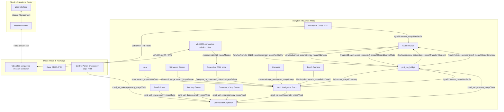

# dionybot

```mermaid
graph TD
    %% Services sur chaque noeud
    subgraph RoverServices [dionybot : Rover on ROS2]
        PX4[PX4 Firmware]
        Nav2[Nav2 Navigation Stack]
        GNSS[Récepteur GNSS RTK]
        Lidar[Lidar]
        USS[Ultrasonic Sensor]
        Bridge[px4_ros_bridge]
        MissionClient[VDA5050-compatible mission client]
        Cameras[Cameras]
        DepthCamera[Depth Camera]
        Mux[Command Multiplexer]
        RowFollower[RowFollower]
        Supervisor[Supervisor FSM Node]
        DockingServer[Docking Server]
        EStop[Emergency Stop Button]
    end

    subgraph DockServices [Dock : Relay & Recharge]
        Mission[VDA5050-compatible mission controller]
        BaseRTK[Base GNSS-RTK]
        Panel[Control Panel: Emergency stop, RTH]
    end

    subgraph CloudServices [Cloud : Opérations Center]
        WebUI[Web Interface]
        Planner[Mission Planner]
    end

    %% ===========================
    %% MISSION & SUPERVISION
    %% ===========================
    WebUI <-->|Mission Management| Planner
    Planner <--->|Fibre avec IP fixe| Mission
    MissionClient <-->|LoRaWAN / RF / WiFi| Mission
    MissionClient -->|/mission:vda5050_msgs/Mission| Supervisor
    Supervisor -->|/navigate_to_pose:nav2_msgs/NavigateToPose| Nav2

    %% ===========================
    %% SENSOR DATA
    %% ===========================
    GNSS <---|LoRaWAN / RF / WiFi| BaseRTK   
    GNSS -->|/gps/fix:sensor_msgs/NavSatFix| PX4
    PX4 -->|/fmu/out/vehicle_GNSS_position:sensor_msgs/NavSatFix| Bridge
    PX4 -->|/fmu/out/vehicle_odometry:nav_msgs/Odometry| Bridge
    Cameras -->|/camera/image_raw:sensor_msgs/Image| Nav2
    DepthCamera -->|/depth/points:sensor_msgs/PointCloud2| Nav2
    USS -->|/ultrasonic/range:sensor_msgs/Range| Nav2
    Lidar -->|/scan:sensor_msgs/LaserScan| Nav2

    %% ===========================
    %% CONTROL / CMD_VEL
    %% ===========================
    Nav2 -->|/cmd_vel_nav2:geometry_msgs/Twist| Mux
    RowFollower -->|/cmd_vel_row:geometry_msgs/Twist| Mux
    DockingServer -->|/cmd_vel_dock:geometry_msgs/Twist| Mux
    Panel -->|/cmd_vel_teleop:geometry_msgs/Twist| Mux
    EStop -->|/cmd_vel_estop:geometry_msgs/Twist| Mux
    Mux -->|/cmd_vel:geometry_msgs/Twist| Bridge
    Bridge  -->|/fmu/in/offboard_control_mode:px4_msgs/OffboardControlMode| PX4
    Bridge  -->|/fmu/in/trajectory_setpoint:px4_msgs/TrajectorySetpoint| PX4
    Bridge  -->|/fmu/in/vehicle_command:px4_msgs/VehicleCommand| PX4
    Bridge -->|/odom:nav_msgs/Odometry| Nav2
    Bridge -->|/gps/fix:sensor_msgs/NavSatFix| Nav2
```